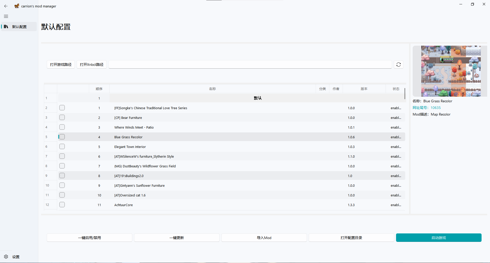

📖 [中文说明请点击这里](README_zh.md)

A modern, user-friendly mod manager for **Stardew Valley**, built with PyQt5 and Fluent Design.

## 🌟 Features

- 🔄 One-click enable/disable mods
- 📁 Sync mods between game folder and profile folder
- 🧩 Auto-detect and categorize mods
- 🌐 Fetch mod info and updates from NexusMods
- 📦 Import mods from local files
- 🧼 Clean and intuitive Fluent-style UI

## 🚀 Getting Started

No Python required! Just download and run the `.exe` file.

### ✅ Requirements

- Windows 10 or later
- Stardew Valley installed
- SWMAPI

### 📦 Installation

1. Download the latest release from [Releases](https://github.com/carrionfs/CarrionModManager/releases)
2. Extract the `.zip` file
3. Double-click `CarrionModManager.exe` to launch

## 📁 Folder Structure
CarrionModManager/  
├── App_entry.py  
├── main_UI.py  
├── assets/    
├── data/    
├── GUI/    
├── core/  
└── README.md  

## 📸 Screenshots

## 🛠 Built With

- [PyQt5](https://pypi.org/project/PyQt5/)
- [QFluentWidgets](https://github.com/zhiyiYo/PyQt-Fluent-Widgets)
- [Python 3.9+](https://www.python.org/)

## 📃 License

This project is released under the MIT License.

## 📺 Video Tutorial

you can watch the user guide video on bilibili/Tiktok for mainland/The Red book @一觉不醒了Zz  
The Link👉： [【星露谷】Fluent风格的星露谷Mod管理器使用指北](https://www.bilibili.com/video/BV1tQfBBMEaQ/)

